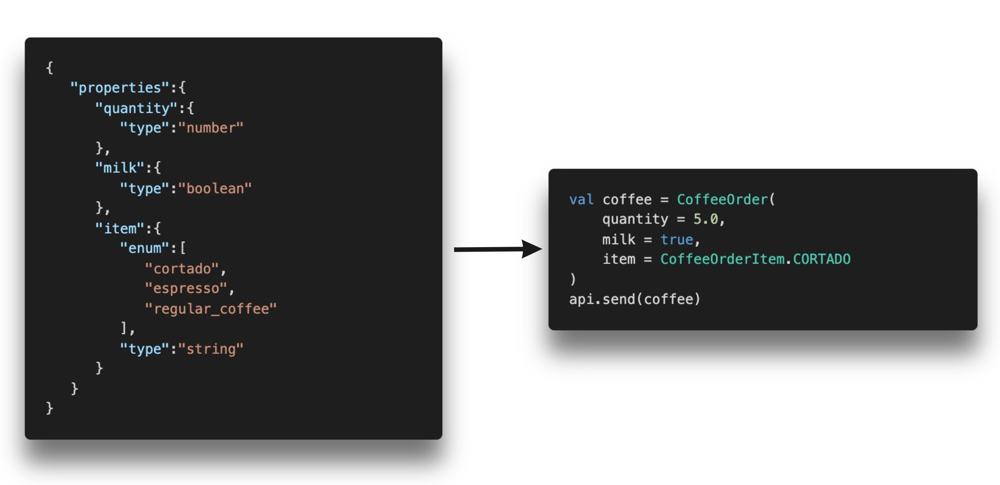

## Overview

Smartype is a powerful code generation tool that allows you to get the most out of the time you spend organizing and defining the structure of your data.

It aims to completely eliminate an entire class of data quality bugs 🐛 by generating statically-typed API clients based on the popular [JSON schema](https://json-schema.org/) standard.

🏁 Smartype is built to translate any JSON schema into type-safe models  
🏁 It gives you auto-complete for your data model in your IDE of choice  
🏁 It's open source and extensible via a plugin system   
🏁 And it's built for all and with ❤️ by [mParticle](https://www.mparticle.com)

### Example

The following JSON schema describes a coffee order with a few required parameters:
- item: An string value with a predefined set of allowed values
- quantity: A numeric value indicating how many coffees were ordered
- milk: A boolean value indicating if you want milk in your coffee

Smartype does the following with this:
- Consumes the JSON schema and generates Kotlin `data` classes
- Uses [Kotlin Multiplatform](https://kotlinlang.org/docs/reference/multiplatform.html) to translate that Kotlin code into other languages and generate consumable binaries
- Surfaces an API to send and receive these "messages", which can be consumed by any analytics provider or your own system



## Supported Environments

Smartype supports the following language environments today:

1. Any JVM environment, including Kotlin and Java for Android and server-side contexts
2. iOS Swift and Objective-C
3. Web support is in alpha and will be released soon in coordination with the release of Kotlin 1.4

## mParticle Customers

Smartype is designed to be used by anyone, but support today is primarily for mParticle's Events API and SDKs by way of the mParticle Smartype receiver.

[Navigate to the mParticle docs](https://docs.mparticle.com/developers/smartype) for more specific docs related to mParticle Data Plans and SDKs.

## Workflow

Smartype is shipped as a CLI tool, and so a the typical workflow would be:

1. Assemble your JSON schema into a file for consumption by Smartype
2. Run Smartype to generate your libraries.
3. Incorporate and use those libraries in any number of environments

## Smartype CLI Usage

Smartype is deployed as an executable jar CLI, and you can download the latest release from the [Github releases](https://github.com/mparticle/smartype/releases) page.

The CLI provides two key commands:

- `init`: Initialize a configuration file that's used by Smartype to generate code.
- `generate`: Generates strongly-type libraries based on your data model

### Smartype `init`

Smartype `init`  will ask you a series of questions and then create a Smartype configuration file.

```bash
java -jar smartype.jar init
```

### Smartype `generate`

Smartype `generate` will read your configuration file and output binaries that are ready for consumption in an application.

```bash
java -jar smartype.jar generate
```

### Integrating Generated Code

To use the objects created by Smartype, you'll want to add the generated code to your projects. You will also want to initialize Smartype when the app starts up, and register any receivers that you would like to get notified for each message that gets logged.

The following code snippets use the mParticle receiver as an example, but receivers can be created to wrap any interface to which you want to send data, including for your own inhouse processing.

#### iOS

> Requirements: Xcode 11.3.1


Smartype `generate` will create a "fat" dynamic framework that you can include directly with your projects.

- To use Smartype on iOS, start by adding `Smartype.framework` to your Xcode project
- Next, import and initialize Smartype prior to use, and register any receivers
- The `SmartypeApi` object will surface a series of methods which each represent the top-level items in your schema
- Pass the fully constructed objects into your `SmartypeApi` instance for all receivers 

```swift    
import Smartype

...
    
let api = SmartypeApi(receivers: [MParticleReceiver(), self])
let chooseCustomAttributes = ChooseItemDataCustomAttributes
    .init(quantity: 5,
          milk: true,
          item: .cortado
)
let itemData = ChooseItemData.init(customAttributes: chooseCustomAttributes)
let chooseItem = api.chooseItem(data: itemData)
api.send(message: chooseItem)
```

#### Android

Smartype `generate` will create an `aar` file that you can include directly with your projects.

To use Smartype on Android, start by adding the generated `smartype.aar` to your project and any 3rd-party receivers that you plan on using:

```kotlin
dependencies {
    implementation "com.mparticle:smartype-mparticle:1.0.2"
    implementation fileTree(dir: 'libs', include: ['**/*.aar'])
}
```

- Import and initialize Smartype prior to use, and register your receivers
- The `SmartypeApi` object will surface a series of methods which each represent the top-level items in your schema
- Pass the fully constructed objects into your `SmartypeApi` instance for all receivers 

```kotlin
val api = SmartypeApi(listOf(MParticleReceiver(), this))
val message = api.chooseItem(
    ChooseItemData(
        ChooseItemDataCustomAttributes(
            quantity = 5.0,
            milk = true,
            item = ChooseItemDataCustomAttributesItem.CORTADO
        )
    )
)
//the message object will now be sent to all receivers
api.send(message)
```

### Example Projects

[Check out the examples here](https://github.com/mParticle/smartype/tree/master/examples)

### Contributing
At mParticle, we are proud of our code and like to keep things open source. If you'd like to contribute, simply fork this repo, push any code changes to your fork, and submit a Pull Request against the `master` branch.

### License
Apache 2.0